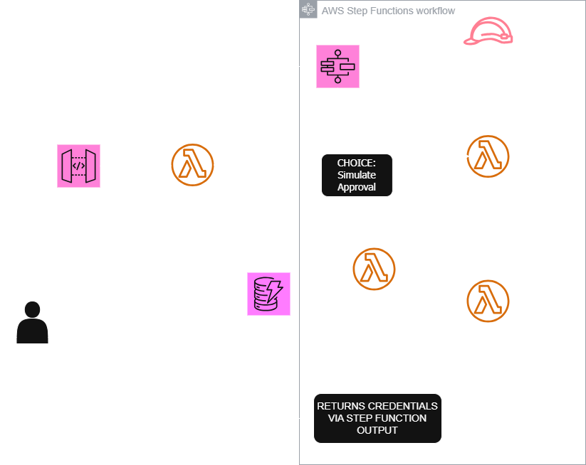

# 🔐 AWS Just-In-Time (JIT) Privileged Access Management

This project eliminates standing admin privileges using temporary role assumption via an approval workflow built entirely with AWS native services.

## 🧱 Architecture Overview

- IAM Identity Center for user identity
- Lambda for request processing and role assumption
- Step Functions for approval flow
- DynamoDB for audit logging
- STS for temporary role assumption

## 🎯 Project Goals

- Solve real industry problems: Remove persistent IAM privileges and implement Just-in-Time (JIT) access
- Audit-friendly: Every request is stored, reviewed, and expire
- Minimal standing privileges: Admin access is only granted when needed and for a limited duration
- Auto-approval for demo: Simulate approval with a toggle
- API-based access: Securely request access using API Gateway with API keys

## 🚀 Features

- Request-driven elevated access
- Approval workflow with Step Functions
- Temporary credentials using STS
- Audit logs in DynamoDB
- Easily extensible (UI, email alerts, expiration cleanup)
